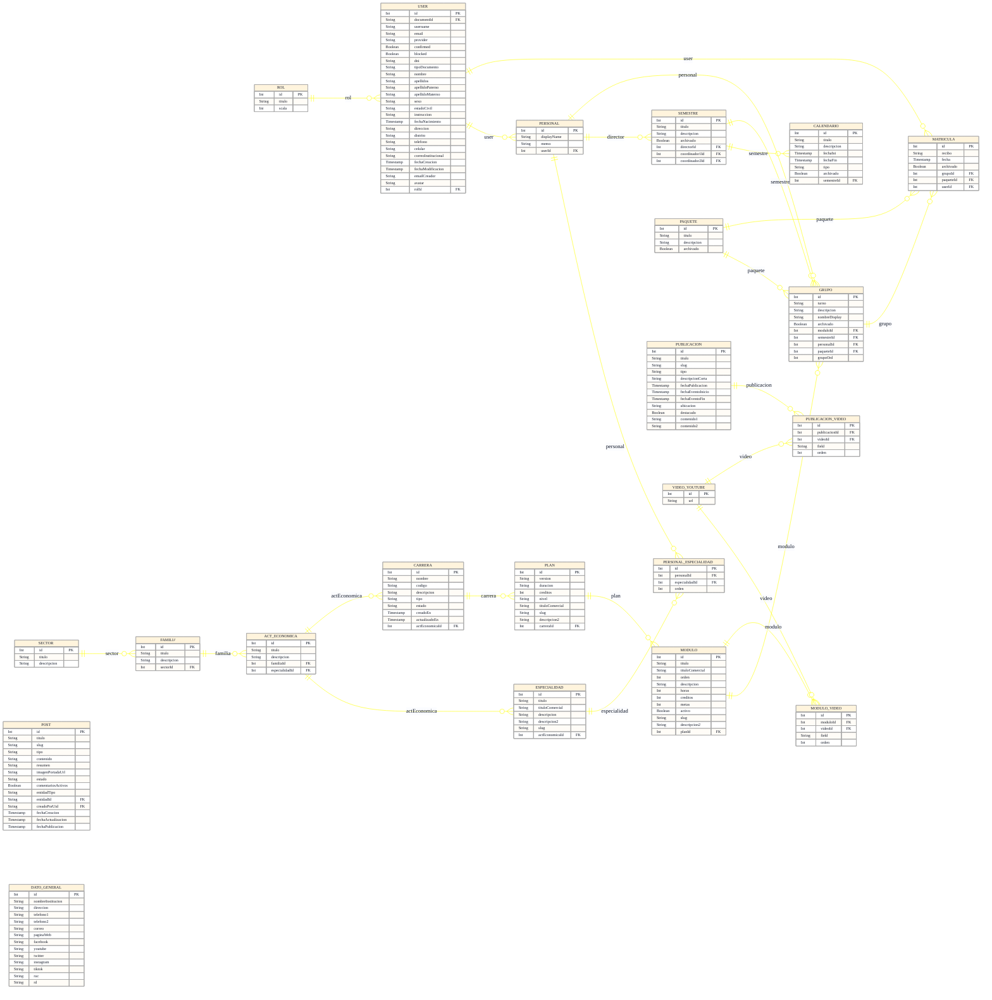

```mermaid
%%{
  init: {
    "theme": "base",
    "themeVariables": {
      "fontFamily": "Segoe UI Light, Calibri Light, Segoe UI, Arial, sans-serif",
      "fontSize": "10px",
      "primaryTextColor": "#111827",
      "primaryBorderColor": "#AAAAAA",
      "lineColor": "#FFFF00"
    },
    "er": {
      "layoutDirection": "LR",
      "minEntityWidth": 65,
      "minEntityHeight": 40,
      "entityPadding": 2
    },
    "themeCSS": ".er.entityBox, .er.attributeBoxOdd, .er.attributeBoxEven { fill: transparent !important; stroke-width: 0.7px; } .er.entityLabel, .er.relationshipLabel, .er.attributeBoxOdd, .er.attributeBoxEven, text { fill: #111827 !important; color: #111827 !important; font-weight: 100 !important; } .er.relationshipLine { stroke-width: 0.7px; }"
  }
}%%

erDiagram
    direction LR

    USER {
        Int id PK
        String documentId FK
        String username
        String email
        String provider
        Boolean confirmed
        Boolean blocked
        String dni
        String tipoDocumento
        String nombre
        String apellidos
        String apellidoPaterno
        String apellidoMaterno
        String sexo
        String estadoCivil
        String instruccion
        Timestamp fechaNacimiento
        String direccion
        String distrito
        String telefono
        String celular
        String correoInstitucional
        Timestamp fechaCreacion
        Timestamp fechaModificacion
        String emailCreador
        String avatar
        Int rolId FK
    }

    ROL {
        Int id PK
        String titulo
        Int scala
    }

    SECTOR {
        Int id PK
        String titulo
        String descripcion
    }

    FAMILIA {
        Int id PK
        String titulo
        String descripcion
        Int sectorId FK
    }

    ESPECIALIDAD {
        Int id PK
        String titulo
        String tituloComercial
        String descripcion
        String descripcion2
        String slug
        Int actEconomicaId FK
    }

    ACT_ECONOMICA {
        Int id PK
        String titulo
        String descripcion
        Int familiaId FK
        Int especialidadId FK
    }

    CARRERA {
        Int id PK
        String nombre
        String codigo
        String descripcion
        String tipo
        String estado
        Timestamp creadoEn
        Timestamp actualizadoEn
        Int actEconomicaId FK
    }

    PLAN {
        Int id PK
        String version
        String duracion
        Int creditos
        String nivel
        String tituloComercial
        String slug
        String descripcion2
        Int carreraId FK
    }

    MODULO {
        Int id PK
        String titulo
        String tituloComercial
        Int orden
        String descripcion
        Int horas
        Int creditos
        Int metas
        Boolean activo
        String slug
        String descripcion2
        Int planId FK
    }

    PERSONAL {
        Int id PK
        String displayName
        String memo
        Int userId FK
    }

    PERSONAL_ESPECIALIDAD {
        Int id PK
        Int personalId FK
        Int especialidadId FK
        Int orden
    }

    SEMESTRE {
        Int id PK
        String titulo
        String descripcion
        Boolean archivado
        Int directorId FK
        Int coordinador1Id FK
        Int coordinador2Id FK
    }

    CALENDARIO {
        Int id PK
        String titulo
        String descripcion
        Timestamp fechaIni
        Timestamp fechaFin
        String tipo
        Boolean archivado
        Int semestreId FK
    }

    GRUPO {
        Int id PK
        String turno
        String descripcion
        String nombreDisplay
        Boolean archivado
        Int moduloId FK
        Int semestreId FK
        Int personalId FK
        Int paqueteId FK
        Int grupoOrd
    }

    PAQUETE {
        Int id PK
        String titulo
        String descripcion
        Boolean archivado
    }

    MATRICULA {
        Int id PK
        String recibo
        Timestamp fecha
        Boolean archivado
        Int grupoId FK
        Int paqueteId FK
        Int userId FK
    }

    PUBLICACION {
        Int id PK
        String titulo
        String slug
        String tipo
        String descripcionCorta
        Timestamp fechaPublicacion
        Timestamp fechaEventoInicio
        Timestamp fechaEventoFin
        String ubicacion
        Boolean destacado
        String contenido1
        String contenido2
    }

    POST {
        Int id PK
        String titulo
        String slug
        String tipo
        String contenido
        String resumen
        String imagenPortadaUrl
        String estado
        Boolean comentariosActivos
        String entidadTipo
        String entidadId FK
        String creadoPorUid FK
        Timestamp fechaCreacion
        Timestamp fechaActualizacion
        Timestamp fechaPublicacion
    }

    VIDEO_YOUTUBE {
        Int id PK
        String url
    }

    MODULO_VIDEO {
        Int id PK
        Int moduloId FK
        Int videoId FK
        String field
        Int orden
    }

    PUBLICACION_VIDEO {
        Int id PK
        Int publicacionId FK
        Int videoId FK
        String field
        Int orden
    }

    DATO_GENERAL {
        Int id PK
        String nombreInstitucion
        String direccion
        String telefono1
        String telefono2
        String correo
        String paginaWeb
        String facebook
        String youtube
        String twitter
        String instagram
        String tiktok
        String ruc
        String rd
    }

    ROL ||--o{ USER : rol
    SECTOR ||--o{ FAMILIA : sector
    ACT_ECONOMICA ||--o{ ESPECIALIDAD : actEconomica
    FAMILIA ||--o{ ACT_ECONOMICA : familia
    ACT_ECONOMICA ||--o{ CARRERA : actEconomica
    CARRERA ||--o{ PLAN : carrera
    PLAN ||--o{ MODULO : plan
    USER ||--o{ PERSONAL : user
    PERSONAL ||--o{ PERSONAL_ESPECIALIDAD : personal
    ESPECIALIDAD ||--o{ PERSONAL_ESPECIALIDAD : especialidad
    PERSONAL ||--o{ SEMESTRE : director
    SEMESTRE ||--o{ CALENDARIO : semestre
    MODULO ||--o{ GRUPO : modulo
    SEMESTRE ||--o{ GRUPO : semestre
    PERSONAL ||--o{ GRUPO : personal
    PAQUETE ||--o{ GRUPO : paquete
    GRUPO ||--o{ MATRICULA : grupo
    PAQUETE ||--o{ MATRICULA : paquete
    USER ||--o{ MATRICULA : user
    MODULO ||--o{ MODULO_VIDEO : modulo
    VIDEO_YOUTUBE ||--o{ MODULO_VIDEO : video
    PUBLICACION ||--o{ PUBLICACION_VIDEO : publicacion
    VIDEO_YOUTUBE ||--o{ PUBLICACION_VIDEO : video
```
